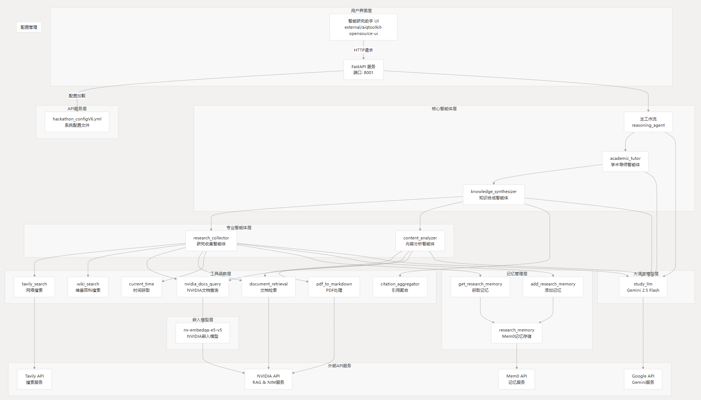

# 智能研究助手
基于NVIDIA NeMo Agent Toolkit构建的学术研究平台

## 📖 项目简介
智能研究助手是一个基于NVIDIA NeMo Agent Toolkit构建的智能研究助手系统，集成多智能体协作架构、NVIDIA RAG文档处理、Mem0智能记忆管理和多源信息搜索功能，支持自动生成专业研究报告，具备完整的中文本地化界面，为学术研究人员提供高效的文献调研和知识合成服务。

## ✨ 核心特性
### 🤖 多智能体协作
research_collector: 研究收集智能体，负责多源数据收集
content_analyzer: 内容分析智能体，专注文档内容分析
knowledge_synthesizer: 知识合成智能体，综合分析多源学术信息
academic_tutor: 学术导师智能体，提供专业指导

### 🔍 多源信息整合
Tavily搜索: 实时网络搜索获取最新研究信息
Wikipedia: 获取权威学术背景知识
NVIDIA文档: 专业技术文档查询
PDF处理: 基于NVIDIA RAG技术的文档分析

### 🧠 智能记忆管理
长期记忆: 基于Mem0的记忆存储系统
研究历史: 保存和检索研究发现及用户偏好
知识积累: 支持长期研究项目的知识管理

### 📊 自动报告生成
执行摘要
研究现状分析
关键发现和趋势
重要论文推荐
未来研究方向
### 🏗️ 系统架构

### 🚀 快速开始
环境要求

Python 3.8+
Node.js 16+
npm 或 yarn

安装步骤

克隆项目

git clone https://github.com/hykun1989/nvidia-hackathon2025

cd hackathonV2

设置环境变量
## API密钥配置  
export MEM0_API_KEY=your_mem0_api_key  
export NVIDIA_API_KEY=your_nvidia_api_key  
export TAVILY_API_KEY=your_tavily_api_key  
export GOOGLE_API_KEY=your_google_api_key  
  
###  前端UI配置  
export NEXT_PUBLIC_ENABLE_INTERMEDIATE_STEPS=true  
export NEXT_PUBLIC_EXPAND_INTERMEDIATE_STEPS=true  
export NEXT_PUBLIC_AUTO_SCROLL=true

安装依赖
### 后端依赖  
cd NeMo-Agent-Toolkit  
pip install -e .  
  
### 前端依赖  
cd ../external/aiqtoolkit-opensource-ui  
npm install

启动服务
### 使用提供的启动脚本  
chmod +x start_hackathonV3.sh  
./start_hackathonV3.sh

### 📁 项目结构
hackathonV2/  
├── NeMo-Agent-Toolkit/          # NVIDIA NeMo Agent Toolkit核心  
├── external/  
│   └── aiqtoolkit-opensource-ui/ # 前端UI界面  
├── configs/  
│   └── hackathon_configV6.yml   # 系统配置文件  
├── pifu_NVIDIA-Sky-Hackathon12-main/ # UI设计参考  
└── start_hackathonV3.sh         # 启动脚本  
### ⚙️ 配置说明
系统配置通过 configs/hackathon_configV6.yml 文件管理，包含：

1、智能体配置: 多智能体协作设置
2、工具配置: 各种搜索和处理工具
3、LLM配置: 大语言模型设置
4、记忆配置: 智能记忆管理
### 🎯 使用场景
学术研究人员
文献调研和信息收集
跨学科研究资料整合
研究报告自动生成

### 🛠️ 技术栈
后端技术

NVIDIA NeMo Agent Toolkit: 核心AI框架
FastAPI: Web服务框架
NVIDIA RAG: 文档处理技术
Mem0: 智能记忆管理

外部服务

Tavily API: 网络搜索
Wikipedia API: 知识库查询
NVIDIA API: 嵌入模型和RAG服务

### 👥 团队
黄颖坤 - 项目负责人，工学博士，3年AI系统开发经验

庄晓如 - 技术负责人，工学博士，高校任职
### 📞 联系我们
📧 邮箱: hykun@live.com
### 🙏 致谢
感谢 NVIDIA 提供的 NeMo Agent Toolkit 框架和相关技术支持。

## 让学术研究更智能，让知识创新更高效
